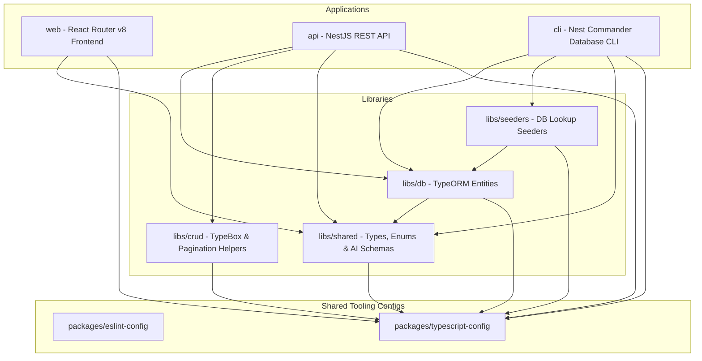

# Travix 🌍✈️

Travix is a modern, AI-powered travel planner and companion dashboard. Users can plan new trips using an interactive multi-step wizard, generate personalized itineraries, estimate trip budgets, explore hotel suggestions, and customize activities — all driven by Google Gemini AI structured generation.

The project is structured as a high-performance **monorepo** managed by **Turborepo** and **Yarn v4 (Workspaces)**.

---

## 🏗️ Monorepo Architecture



### Monorepo Components

- **`apps/`**
    - [web](file:///Users/ravitejasalva/Projects/personal/travix/apps/web): User-facing interactive React Router v8 frontend.
    - [api](file:///Users/ravitejasalva/Projects/personal/travix/apps/api): Core REST API server powered by NestJS with TypeORM, CQRS, and Google Gemini AI integrations.
    - [cli](file:///Users/ravitejasalva/Projects/personal/travix/apps/cli): Command-line interface tool for database initialization, migration management, and lookup seeding.
- **`libs/`**
    - [crud](file:///Users/ravitejasalva/Projects/personal/travix/libs/crud): Internal NestJS request/response validation framework built on `@sinclair/typebox`.
    - [db](file:///Users/ravitejasalva/Projects/personal/travix/libs/db): Unified TypeORM entity models representing the database schema.
    - [seeders](file:///Users/ravitejasalva/Projects/personal/travix/libs/seeders): Seeds static data (countries, cities, currencies) and sample records into the database.
    - [shared](file:///Users/ravitejasalva/Projects/personal/travix/libs/shared): Shared types, enums, constants, Gemini structured output schemas, and common utilities.
- **`packages/`**
    - [eslint-config](file:///Users/ravitejasalva/Projects/personal/travix/packages/eslint-config): Shared linting configurations (Base, NestJS, and React Router).
    - [typescript-config](file:///Users/ravitejasalva/Projects/personal/travix/packages/typescript-config): Shared TypeScript compilation configurations.

---

## 🛠️ Technology Stack & Selection Rationale

| Layer                  | Technology                             | Rationale                                                                                                                        |
| :--------------------- | :------------------------------------- | :------------------------------------------------------------------------------------------------------------------------------- |
| **Monorepo Engine**    | **Turborepo**                          | High-performance cache-aware build tool that accelerates monorepo pipeline execution.                                            |
| **Package Manager**    | **Yarn v4**                            | Utilizes modern Yarn workspaces for fast dependency resolution and clean workspace linking.                                      |
| **Frontend Framework** | **React Router v8 (formerly Remix)**   | Selected for robust server-side routing capabilities, clean directory patterns, and excellent single-page app (SPA) performance. |
| **Styling**            | **Tailwind CSS v4**                    | Provides utility-first, performant, and flexible styling. Integrated via `@tailwindcss/vite` for fast build cycles.              |
| **Backend Engine**     | **NestJS**                             | Selected for its enterprise-ready modular structure, TypeScript-first support, and clean architecture enforcement.               |
| **Database ORM**       | **TypeORM**                            | Strong integration with NestJS, supporting both raw SQL query building and strict entity definitions.                            |
| **AI Integration**     | **Google Gemini AI (`@google/genai`)** | Utilized for structured JSON output trip planning (itinerary generation, hotel suggestions, budget estimations).                 |
| **Validation**         | **TypeBox (Backend) / Zod (Frontend)** | TypeBox offers high runtime performance and schema serialization for APIs, while Zod integrates cleanly with frontend forms.     |

---

## 🚀 Getting Started

### Prerequisites

- **Node.js**: >= 20.x
- **Yarn**: Yarn v4 (`packageManager` in root `package.json` configures this)
- **Database**: MySQL or MariaDB instance

### Setup

1.  **Clone and install dependencies**:

    ```bash
    yarn install
    ```

2.  **Configure Environment Variables**:
    Create `.env` files in `apps/api` and `apps/cli`.

    _Example `.env` configuration (for API):_

    ```env
    PORT=6500
    HOST=0.0.0.0

    DB_HOST=127.0.0.1
    DB_PORT=3306
    DB_USERNAME=root
    DB_PASSWORD=yourpassword
    DB_DATABASE=travix

    JWT_ACCESS_SECRET=your_access_secret_key
    JWT_ACCESS_EXPIRES_IN=15m
    JWT_REFRESH_SECRET=your_refresh_secret_key
    JWT_REFRESH_EXPIRES_IN=7d

    # GEMINI API Key (optional, falls back to mock stub generation if not provided)
    GEMINI_API_KEY=AIzaSy...
    GEMINI_MODEL=gemini-2.5-flash
    ```

3.  **Initialize the Database**:
    Use the CLI tool to initialize database schemas and run baseline seeders (static countries, states, cities, currencies, and roles):
    ```bash
    # Build core libraries and start database init/seed
    yarn cli db init
    yarn cli db seed
    ```

### Running Development Servers

Start all application development tasks (API and Web):

```bash
yarn dev
```

To run a specific application only (e.g., frontend):

```bash
yarn dev --filter=web
```

To run the API only:

```bash
yarn dev --filter=api
```

---

## 🧪 Commands & Scripts

- **`yarn build`**: Build all apps, libraries, and packages.
- **`yarn dev`**: Spin up development environments.
- **`yarn lint`**: Run ESLint checks across the workspace.
- **`yarn format`**: Run Prettier formatting on source files.
- **`yarn test`**: Execute test suites.
