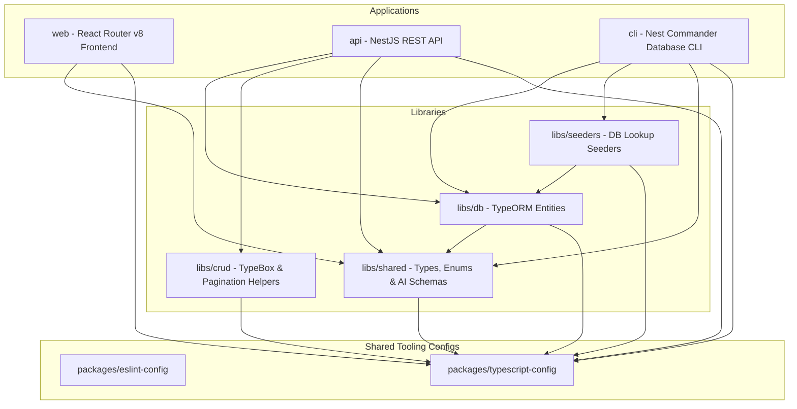

<p align="center">
  
</p>

# Travix - Travel Intelligence Experience 🌍✈️

Travix is a modern, AI-powered travel planner and companion dashboard. Users can plan new trips using an interactive multi-step wizard, generate personalized itineraries, estimate trip budgets, explore hotel suggestions, and customize activities — all driven by Google Gemini AI structured generation.

🌐 **Live Demo (Frontend)**: [https://travix-zeta.vercel.app](https://travix-zeta.vercel.app)  
⚡ **API Endpoint (NestJS)**: [https://travix-api.vercel.app/](https://travix-api.vercel.app/)

The project is structured as a high-performance **monorepo** managed by **Turborepo** and **Yarn v4 (Workspaces)**.

---

## 🏗️ Monorepo Architecture



### Monorepo Components

- **`apps/`**
    - [web](./apps/web): User-facing interactive React Router v8 frontend.
    - [api](./apps/api): Core REST API server powered by NestJS with TypeORM, CQRS, and Google Gemini AI integrations.
    - [cli](./apps/cli): Command-line interface tool for database initialization, migration management, and lookup seeding.
- **`libs/`**
    - [crud](./libs/crud): Internal NestJS request/response validation framework built on `@sinclair/typebox`.
    - [db](./libs/db): Unified TypeORM entity models representing the database schema.
    - [seeders](./libs/seeders): Seeds static data (countries, cities, currencies) and sample records into the database.
    - [shared](./libs/shared): Shared types, enums, constants, Gemini structured output schemas, and common utilities.
- **`packages/`**
    - [eslint-config](./packages/eslint-config): Shared linting configurations (Base, NestJS, and React Router).
    - [typescript-config](./packages/typescript-config): Shared TypeScript compilation configurations.

For detailed architecture patterns and folders structure, see [High-Level Architecture](#-high-level-architecture-explanation).

---

## 🛠️ Technology Stack & Selection Rationale

The tech stack is selected to prioritize developer productivity, type safety, runtime performance, and structural integrity.

### Core Frameworks & Tooling

| Layer                  | Technology            | Rationale & Justification                                                                                                                                                         |
| :--------------------- | :-------------------- | :-------------------------------------------------------------------------------------------------------------------------------------------------------------------------------- |
| **Monorepo Engine**    | **Turborepo**         | Cache-aware build tool that accelerates monorepo pipeline execution by reusing build outputs and parallelizing script tasks.                                                      |
| **Package Manager**    | **Yarn v4**           | Utilizes workspaces for fast dependency resolution and clean cross-linking of internal libraries without NPM registry overhead.                                                   |
| **Frontend Framework** | **React Router v8**   | Selected for robust client-side routing, single-page app (SPA) performance, built-in loading states, and clean layout nesting. Runs in React 19 mode.                             |
| **Backend Engine**     | **NestJS**            | Enforces a modular, enterprise-ready codebase. Its dependency injection framework, built-in decorators, and support for CQRS simplify complex backend integrations.               |
| **Database ORM**       | **TypeORM**           | Strong integration with NestJS, supporting declarative entity schemas, migrations, automated relationships, and seeder management via typeorm-extension.                          |
| **Database System**    | **MySQL / MariaDB**   | Production-ready, ACID-compliant relational database. Perfect for managing relational mappings (Users → Trips → Itineraries → Activities) with strong foreign key integrity.      |
| **AI Integration**     | **Google Gemini AI**  | Utilizes `@google/genai` SDK for low-latency structured JSON generation, guaranteeing compliance with internal application schemas.                                               |
| **Validation**         | **TypeBox (Backend)** | Schema definition library that executes up to 100x faster than traditional Class Validator decorators and compiles down to JSON Schema for automatic OpenAPI document generation. |
| **Validation**         | **Zod (Frontend)**    | Fits seamlessly with React Hook Form to provide rapid validation, field error handling, and type inferences in user forms.                                                        |

---

## 📐 High-Level Architecture Explanation

The application follows a clean-separation architecture, structured to decouple user interaction, API endpoints, schema validation, and database operations.

```
                  ┌────────────────────────┐
                  │   web (React Router)   │
                  └───────────┬────────────┘
                              │ REST HTTP Requests (JSON)
                              ▼
                  ┌────────────────────────┐
                  │    api (NestJS API)    │
                  └─────┬────────────┬─────┘
        Enters HTTP     │            │ Triggers Commands/Queries
        Controller      ▼            ▼
                  ┌──────────┐   ┌──────────┐
                  │ Command  │   │  Query   │  (CQRS Layer)
                  │   Bus    │   │   Bus    │
                  └─────┬────┘   └────┬─────┘
                        ▼             ▼
                  ┌──────────┐   ┌──────────┐
                  │ Command  │   │  Query   │
                  │ Handler  │   │ Handler  │
                  └─────┬────┘   └────┬─────┘
                        │             │
                        └──────┬──────┘ Interacts with DB
                               ▼
                    ┌─────────────────────┐
                    │  libs/db (TypeORM)  │
                    └──────────┬──────────┘
                               ▼
                    ┌─────────────────────┐
                    │ MySQL / MariaDB DB  │
                    └─────────────────────┘
```

### 1. Monorepo Integration & Shared Contracts

All modules and applications are coordinated using a monorepo workspace structure:

- Shared TypeScript types, configuration interfaces, and domain enums live in `@travix/shared`.
- To avoid duplication, the database schema (entities) is declared once in `@travix/db` and imported by the `api` and `cli`.
- Cross-cutting configurations like ESLint rules and TypeScript tsconfig base files are centralized under `packages/` to ensure zero drift.

### 2. NestJS Backend CQRS Design

We apply a strict **CQRS (Command Query Responsibility Segregation)** pattern in the API backend:

- **Controllers** are thin presentation layers that define REST endpoints. They handle only request validation and dispatch Command or Query objects via the NestJS CQRS bus.
- **Commands** (e.g., `CreateTripCommand`, `RegenerateDayCommand`) capture intent to alter application state. They are processed by Command Handlers that run business rules and write to the database.
- **Queries** (e.g., `GetTripQuery`, `SearchCitiesQuery`) capture intent to fetch data. They read from the database, map data models to DTOs, and return response payloads.
- All handlers query the database using TypeORM's `datasource.manager` instead of injecting individual repositories, allowing transactional logic (`manager.transaction(...)`) to be coordinated easily.

---

## 🔐 Authentication & Authorization Approach

We enforce security at both the API and Web layer using a stateless, role-based architecture.

```
   [User Login] ──► Authenticates with Credentials ──► API Issues { AccessToken, RefreshToken }
                                                                         │
   [Next API Request] ◄── Validates JwtAuthGuard ◄── Bearer Token Injected ◄── Saved in Zustand Store
```

### 1. Stateless Authentication (JWT)

- Users register and log in via secure password hashing using `bcrypt` (with standard salt rounds).
- Successful credentials issue a stateless JSON Web Token (JWT) containing the user profile identifier and role.
- **Access Tokens**: Short-lived (15 minutes), passed as a `Bearer` header on API requests.
- **Refresh Tokens**: Long-lived (7 days), stored in the application database and client, allowing users to request new access tokens without re-entering credentials.
- Handlers extract the active profile via the `@AuthUser()` decorator.

### 2. Authorization (CASL)

- Resource-based and attribute-based security is managed using **CASL**.
- Handlers check resource ownership (e.g. "Only the user who created this Trip can edit its Activities") dynamically.
- The CLI handles system bootstrapping by inserting baseline access control roles (e.g., `User`, `Admin`).

---

## 🤖 AI Agent Design and Purpose

The AI agent functions as the intelligence engine of Travix, parsing user requests and returning fully structured, valid database-ready entities.

### Structured Schema Enforcement

Instead of prompting Gemini for unstructured markdown or general text, the API uses Google's latest structured generation protocols via the `@google/genai` SDK:

1. We define target schemas (e.g. `generationTripSchema`) in `@travix/shared` using type-safe declarations.
2. These schemas are passed directly to Gemini API requests as the `responseSchema` constraint.
3. The AI model output is mathematically guaranteed to fit our schema structure (e.g. matching fields like `estimatedFlightCost`, `activities`, `hotelSuggestions`).

### Stub & Fallback Client

To allow developer productivity without incurring AI query costs or dependency on a `GEMINI_API_KEY`, the application features a dynamic fallback:

- If no `GEMINI_API_KEY` environment variable is defined, NestJS boots using the `StubGenerationService`.
- The stub client mimics the Gemini AI by generating deterministic, logically sound travel schemas instantly based on the requested location, budget, and travel duration.

---

## 🎨 Creative & Custom Features

Travix introduces granular travel editing tools to avoid the limitations of "all-or-nothing" AI planners:

### 1. Granular Single-Day Regeneration

Traditional planners require rebuilding the entire trip if a user dislikes one day's schedule. Travix solves this with **Single-Day Regeneration**:

- A user can request to rebuild a specific day (e.g., "Regenerate Day 3 with more historical sites").
- The backend constructs a targeted prompt containing the original trip details, the current schedule for the target day, and the user's specific feedback.
- It asks Gemini to redesign _only that single day_, conforming to the standard `generationDaySchema`.
- The command handler then updates only the targeted `ItineraryDay` and its child `Activity` records, keeping the rest of the trip (Days 1, 2, 4, etc.) completely intact.

### 2. Hot-Swap Hotel Suggestions

- If hotel suggestions do not match a user's preference, they can prompt the AI to regenerate hotel lists for the target city using new parameters (budget, star ratings, or specific districts).
- The backend queries the Gemini API with the city context and swaps out the trip's `HotelSuggestion` child records in the database.

---

## ⚖️ Key Design Decisions & Trade-offs

### 1. Strict CQRS Architecture

- **Trade-off**: Requires writing more files (Command, Command Handler, Query, Query Handler) for even basic operations.
- **Decision**: We accepted this boilerplate overhead to ensure high-scale maintainability. No business logic leaks into NestJS Controllers, guaranteeing that the CLI, Cron-tasks, or REST API endpoints invoke the exact same, reusable handlers.

### 2. TypeBox vs. Class Validator

- **Trade-off**: TypeBox schemas require slightly different syntax conventions compared to standard NestJS class decorators.
- **Decision**: Chosen because TypeBox offers exceptional serialization speeds (faster HTTP response compilation) and compiles natively into OpenAPI swagger configurations, keeping our API documentation and validation schemas perfectly synced.

### 3. Soft-Deletes

- **Trade-off**: Database storage increases since records are never fully deleted.
- **Decision**: All planning and user entities extend a `BaseEntity` equipped with a `deletedAt` field. This enables easy recovery if users accidentally delete a trip.

### 4. ULIDs (Universally Unique Lexicographically Sortable Identifiers)

- **Trade-off**: Marginally higher storage footprint than traditional autoincrementing integers.
- **Decision**: Replaces standard UUIDs to allow chronological sorting by primary key out-of-the-box, preventing database page fragmentation while keeping identifiers secure and non-predictable.

---

## ⚠️ Known Limitations

1. **Single-Destination Trips**: The trip generation wizard plans itineraries around a single city/destination at a time. Multi-city stops must be planned as separate trips.
2. **Stateless Booking API**: The budget estimation and hotel/flight suggestions are generated using AI-trained estimations rather than live reservation APIs (like Amadeus or Sabre).
3. **Cold-Start Latency**: First-time AI queries might experience a 2–3 second delay while Google Gemini constructs the structured JSON response layout.

---

## 🚀 Getting Started

Follow these step-by-step instructions to set up Travix locally.

### Prerequisites

- **Node.js**: >= 20.x
- **Yarn**: Yarn v4 (workspaces configuration)
- **Database**: MySQL or MariaDB instance (local or hosted)

### Local Setup

1. **Clone the Repository**:

    ```bash
    git clone <repository-url>
    cd travix
    ```

2. **Configure Environment Variables**:
   You need to configure `.env` files for the API, CLI, and Web client.

    - **API Environment (`apps/api/.env`)**:

        ```env
        PORT=6500
        HOST=0.0.0.0
        DB_HOST=127.0.0.1
        DB_PORT=3306
        DB_USERNAME=root
        DB_PASSWORD=yourpassword
        DB_DATABASE=travix
        JWT_ACCESS_SECRET=your_access_secret_key
        JWT_ACCESS_EXPIRES_IN=15m
        JWT_REFRESH_SECRET=your_refresh_secret_key
        JWT_REFRESH_EXPIRES_IN=7d
        GEMINI_API_KEY=AIzaSy... # Optional: falls back to stub mock generation if missing
        GEMINI_MODEL=gemini-2.5-flash
        ```

    - **CLI Environment (`apps/cli/.env`)**:

        ```env
        DB_HOST=127.0.0.1
        DB_PORT=3306
        DB_USERNAME=root
        DB_PASSWORD=yourpassword
        DB_DATABASE=travix
        ```

    - **Web Environment (`apps/web/.env`)**:
        ```env
        VITE_API_URL=http://localhost:6500
        ```

3. **Install Workspace Dependencies**:

    ```bash
    yarn install
    ```

4. **Build Core Libraries and Packages**:
   Build the internal dependencies required by the apps:

    ```bash
    yarn build
    ```

5. **Initialize Database Schema**:
   Drop and create database schemas:

    ```bash
    yarn cli db init
    ```

6. **Run Database Migrations**:
   Execute migrations to build initial schema tables:

    ```bash
    yarn cli db migrations:run
    ```

7. **Seed Database Lookup Data**:
   Seed countries, states, cities, currencies, and roles:
    ```bash
    yarn cli db seed --initial
    ```

### Running Development Servers

To run the API and Web client concurrently:

```bash
yarn dev --filter={api, web}
```

To run a specific application only (e.g., frontend):

```bash
yarn dev --filter=web
```

To run the API only:

```bash
yarn dev --filter=api
```

---

## ☁️ Deployment Instructions

> [!WARNING]
> The live deployment of Travix uses **free and trial tier hosting services**.
> As a result, the application may experience cold starts, slower response times, and general resource constraints when accessed after inactivity.

### Deployed Services & Providers

- **Database (MySQL)**: Deployed on **[Aiven.io](https://aiven.io/)** (Free Trial MySQL instance).
- **Backend API (NestJS REST API)**: Deployed on **[Vercel.com](https://vercel.com/)** (Free Hobby tier).
- **Frontend Web (React Router v8 SPA)**: Deployed on **[Vercel.com](https://vercel.com/)** (Free Hobby tier).

### Deployment Setup Details

#### 1. Frontend Web (Vercel)

- **Framework Preset**: Vite
- **Root Directory**: `apps/web`
- **Build Command**: `yarn build --filter=web`
- **Output Directory**: `build/client`
- **Environment Variables**: Configure `VITE_API_URL` to point to your Render API server URL.

#### 2. Backend REST API (Render)

- **Root Directory**: `apps/api`
- **Build Command**: `yarn build --filter=api`
- **Start Command**: `node apps/api/dist/main.js` (or trigger `yarn workspace api start:prod` after building)
- **Database Migrations**: Prior to launching the server, execute migrations on the live database:
    ```bash
    yarn cli db migrations:run
    ```

---

## 🧪 Commands & Scripts

- **`yarn build`**: Build all apps, libraries, and packages.
- **`yarn dev`**: Spin up development environments.
- **`yarn lint`**: Run ESLint checks across the workspace.
- **`yarn format`**: Run Prettier formatting on source files.
- **`yarn test`**: Execute test suites.
- **`yarn cli`**: Start the Nest Commander database command-line wrapper.
