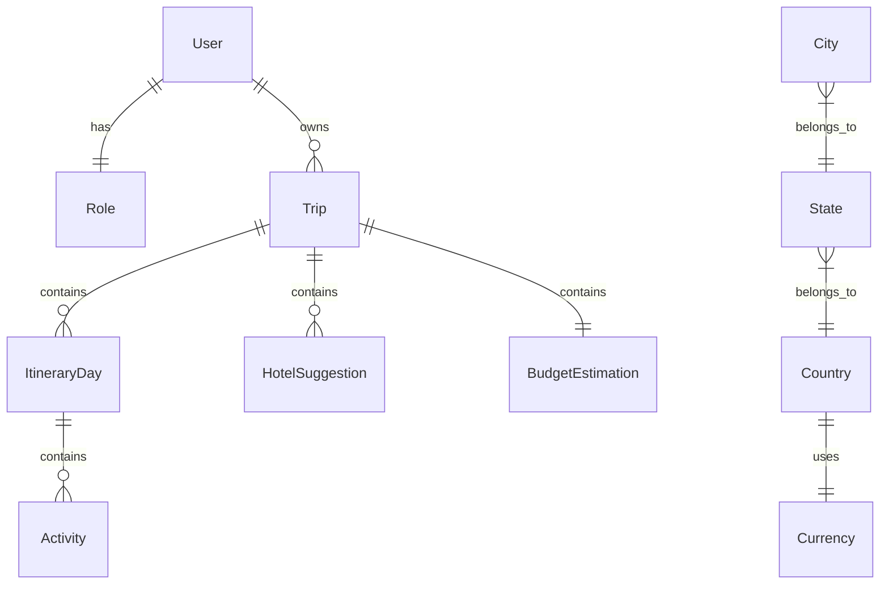

# `@travix/db` (TypeORM Entities Library) 📦🗄️

This shared internal library defines the **database schema and TypeORM entities** for the Travix application. It is consumed by both the **API server** (for queries and transactions) and the **CLI tool** (for migration generation, execution, and seeding).

---

## 🛠️ Tech Stack & Dependencies

- **ORM**: [TypeORM](https://typeorm.io/)
- **Primary Keys**: Universal Unique Lexicographically Sortable Identifiers (**ULIDs**) via the `ulid` library.
    - _Why_: Offers lexicographical sorting and high performance while avoiding predictable autoincrementing IDs and space-heavy UUIDs.
- **Enums**: Utilizes enums defined in `@travix/shared` to enforce data types at both DB schema and TypeScript levels.

---

## 🗺️ Entity Schema & Relationships



### 1. Core Models

- **`BaseEntity`** (`base.entity.ts`)
    - Abstract base containing common columns: `id` (ULID primary key), `createdAt`, `updatedAt`, and `deletedAt` (enabling soft deletes). All other entities extend this base.
- **`User`** (`user.entity.ts`)
    - Attributes: `username`, `password` (hashed), and `roleId`.
- **`Role`** (`role.entity.ts`)
    - Represents permissions scopes (e.g. `User`, `Admin`).

### 2. Planning Models

- **`Trip`** (`trip.entity.ts`)
    - Stores core planning parameters: destination city, dates, companions configuration, budget tier, and owner references.
- **`ItineraryDay`** (`itinerary-day.entity.ts`)
    - Holds daily itineraries: `dayNumber`, brief summaries, and parent trip associations.
- **`Activity`** (`activity.entity.ts`)
    - Specific events within a day: `name`, `description`, `type` (Sightseeing, Dining, Adventure, Transit), and display order.
- **`HotelSuggestion`** (`hotel-suggestion.entity.ts`)
    - Suggested lodging suggestions: `name`, `category` (Budget, MidRange, Luxury), `rating`, and short descriptions.
- **`BudgetEstimation`** (`budget-estimation.entity.ts`)
    - Estimations: estimated flight costs, lodging, food, activities, and aggregated totals.

### 3. Lookup Models

- **`Country`**, **`State`**, **`City`**
    - Static geolocation mappings used to search destinations in the trip planner.
- **`Currency`**
    - Contains country-specific currencies.

---

## 🚀 Building the Library

Compile TypeScript entities:

```bash
yarn workspace @travix/db build
```

Any modifications to the entity definitions require compiling this package first before building or running `api` or `cli`.
